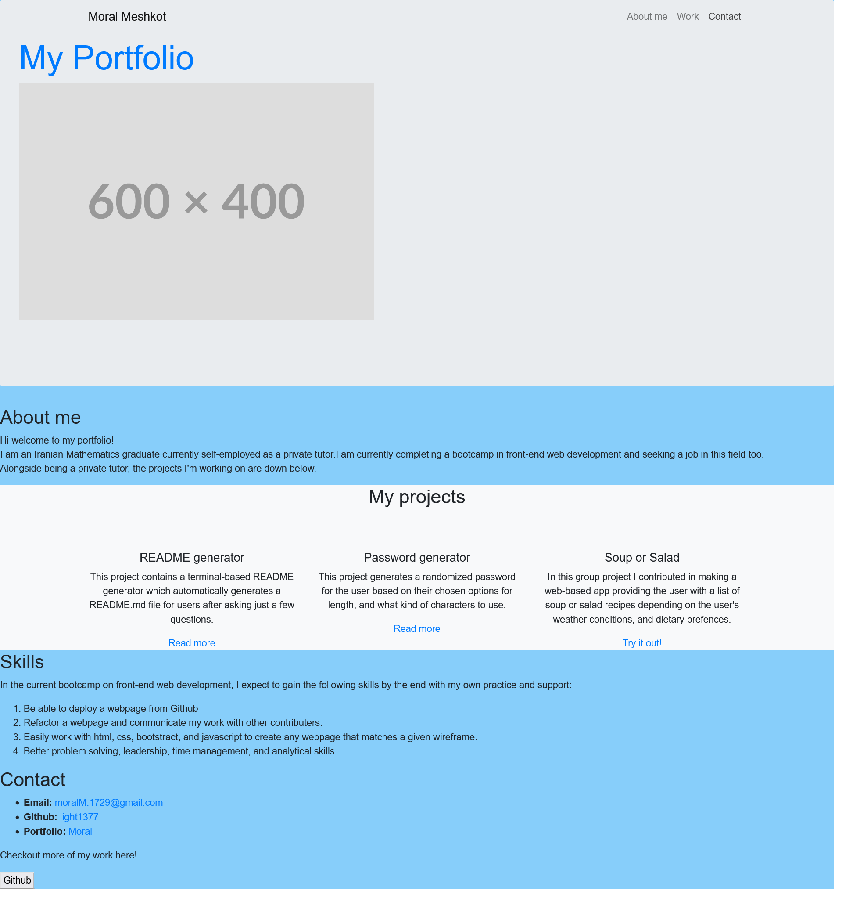

# Bootstrap-Portfolio
## Description
In this project I have used Bootstrap to v=creat a portfilio page. There are 4 sections: About me, Work, Skills, and how to contact me with an interactive navbar at the top

## Use
I wil use this page to refer future employers to my project, and for a short introduction about myself

##  Contributors
Moral Meshkot

## Challenges
At tyhe start I thought this would be a fairly simple project, but I then realised I didn't know how to make a hutton which is also a hyperlink to another page at all. After doing some reading on this topic I think this was not a requirement and since I was short on time I left the button without the "on click" function. I hope to be able to improve this project when at a future time.

Github URL:
https://github.com/light1377/Bootstrap-Portfolio

Website URL:
https://light1377.github.io/Bootstrap-Portfolio/

Screenshot:

